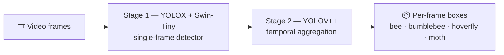
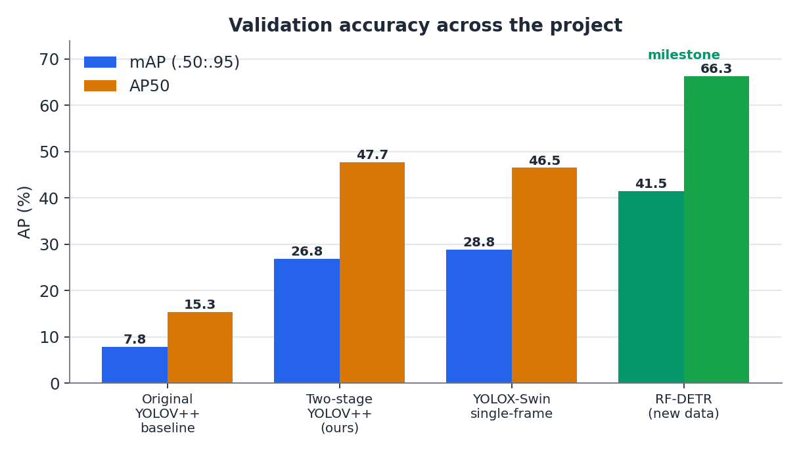
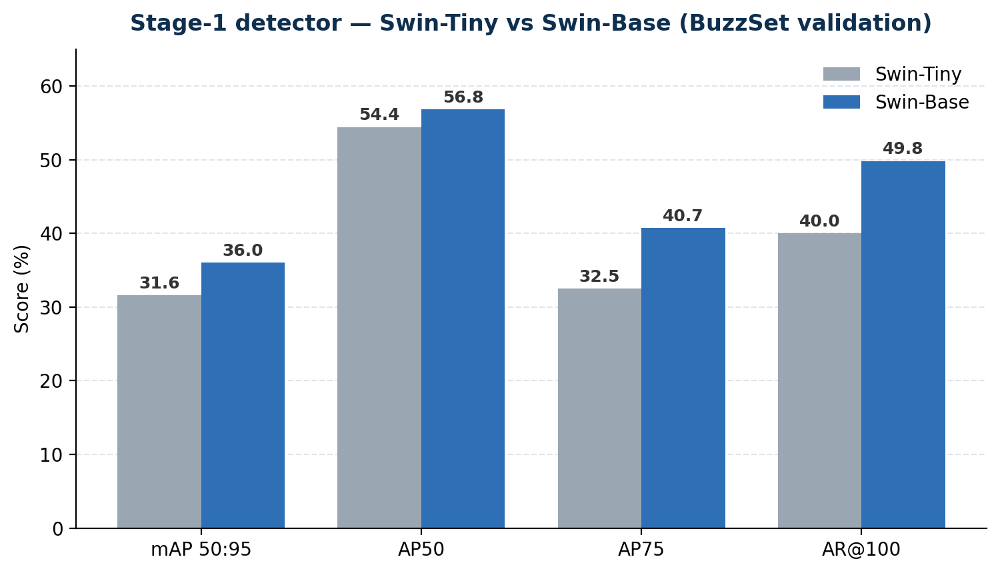
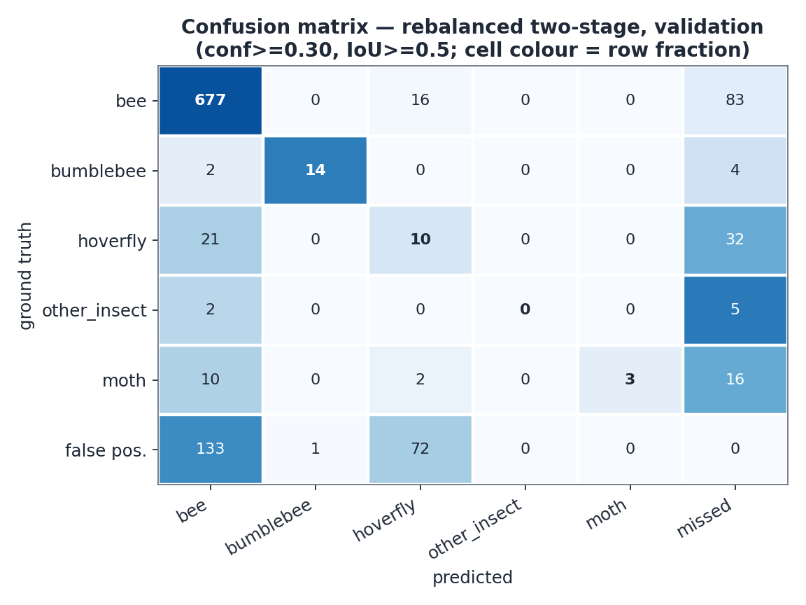
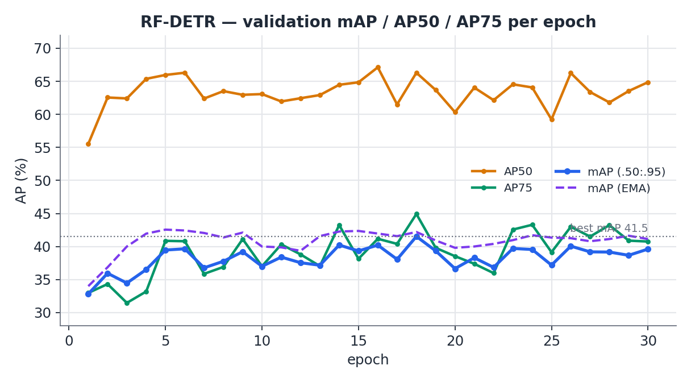

<h1 align="center">🐝 BuzzSet YOLOV++</h1>
<p align="center"><b>Video pollinator detection — finding bees, bumblebees, hoverflies & moths in the wild, frame by frame.</b></p>

<p align="center">
  
  
  
  
  
</p>

---

## Overview

**BuzzSet YOLOV++** is the video-detection track of the BuzzSet pollinator-monitoring
project. Pollinators are small, fast, and easily confused with one another — a single
still frame is often not enough. We tackle this with a **two-stage temporal detector**
that first finds insects per frame, then sharpens those detections using information from
neighbouring frames.

The models are trained on the **4-class BuzzSet Challenge video dataset**:

| 🐝 bee | 🐝 bumblebee | 🦟 hoverfly | 🦋 moth |
|:---:|:---:|:---:|:---:|

> **Why it's hard:** hoverflies are *bee mimics* — evolved to look like bees for
> protection. Telling them apart is the central challenge of this project.

## The pipeline



**Stage 1** — a YOLOX detector with a Swin Transformer backbone proposes boxes on each
frame independently. **Stage 2** — YOLOV++ aggregates features across a window of frames,
so a hard-to-read insect in one frame borrows evidence from the frames around it.

## Results

Validation-set COCO AP (%). Numbers come straight from our training runs on the new
4-class data.

### Progress across the project

Every model iteration lifted accuracy — from the original YOLOV++ baseline to the
current best single-frame model.

<p align="center"></p>

| Model | mAP (.50:.95) | AP50 |
|---|:---:|:---:|
| Original YOLOV++ baseline | 7.8 | 15.3 |
| Two-stage YOLOV++ *(ours)* | 26.8 | 47.7 |
| YOLOX-Swin single-frame | 28.8 | 46.5 |
| **RF-DETR (new data)** 🏆 | **41.5** | **66.3** |

### Stage-1 backbone: Swin-Tiny vs Swin-Base

Bumping the backbone from Tiny to Base buys accuracy across the board — most notably on
the stricter AP75 and recall metrics.

<p align="center"></p>

| Metric | Swin-Tiny | Swin-Base |
|---|:---:|:---:|
| mAP 50:95 | 31.6 | **36.0** |
| AP50 | 54.4 | **56.8** |
| AP75 | 32.5 | **40.7** |
| AR@100 | 40.0 | **49.8** |

### Where it still struggles

The confusion matrix exposes the core problem: **hoverflies get read as bees** (or missed
entirely), and the rare classes are easy to lose. This is the failure mode the temporal
stage — and ongoing work — aims to fix.

<p align="center"></p>

- **bee** — strong (677 correct).
- **hoverfly** — the bee-mimic; frequently predicted as *bee* or *missed*.
- **bumblebee / moth** — rare, so every miss hurts.

<details>
<summary><b>RF-DETR training curve (single-frame track)</b></summary>

<p align="center"></p>

Best mAP **41.5** at epoch 17 (AP50 66.3, AP75 44.9); EMA peak 42.6.
</details>

## Repository layout

```
.
├── buzzset_yolovpp_comparison/   # our code
│   ├── exps/                     #   training configs (buzzset_v2_det_swin_tiny*.py)
│   ├── buzzset_yolov/            #   dataset wrapper, class-balanced sampling, torch shim
│   ├── scripts/                  #   train / eval runners
│   ├── rfdetr/                   #   RF-DETR track (parallel single-frame model)
│   ├── generated_v2/annotations/ #   4-class keyframe COCO labels (train / valid)
│   ├── README.md                 #   code-level docs
│   └── RUN_NEW_DATA.md           #   full train / eval commands
├── YOLOV-master/                 # upstream YOLOV / YOLOX (provides the `yolox` package)
└── assets/                       # figures used in this README
```

> **Not in the repo (by design):** the BuzzSet video dataset (`data/`, ~34 GB),
> pretrained/trained weights (`weights/`, `*.pth`), and training runs / checkpoints
> (`buzzset_yolovpp_comparison/runs/`). These are large binary/dataset assets kept out
> of git — see [`.gitignore`](.gitignore).

## Quickstart — train the stage-1 detector

Windows / PowerShell, from the repo root:

```powershell
powershell -ExecutionPolicy Bypass -File .\buzzset_yolovpp_comparison\scripts\train_stage1_detector.ps1 `
  -Exp ".\buzzset_yolovpp_comparison\exps\buzzset_v2_det_swin_tiny.py" `
  -Ckpt ".\weights\yolovpp_swin_tiny.pth" -BatchSize 16 -Fp16 -MaxEpoch 12
```

The exp defaults to `./data`; set the `BUZZSET_V2_ROOT` env var to point elsewhere.
Full train/eval commands (fast & full configs, evaluation, RF-DETR) live in
[`buzzset_yolovpp_comparison/RUN_NEW_DATA.md`](buzzset_yolovpp_comparison/RUN_NEW_DATA.md).

## Acknowledgements

Built on [YOLOV](https://github.com/YuHengsss/YOLOV) / [YOLOX](https://github.com/Megvii-BaseDetection/YOLOX).
Part of the **BuzzSet** pollinator-monitoring project. RF-DETR track contributed by a teammate.
